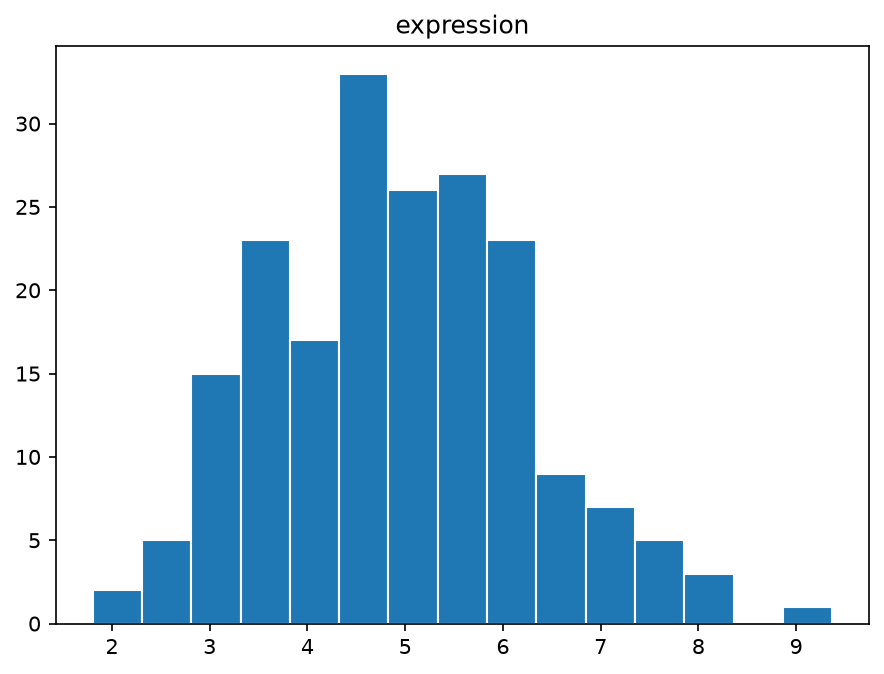
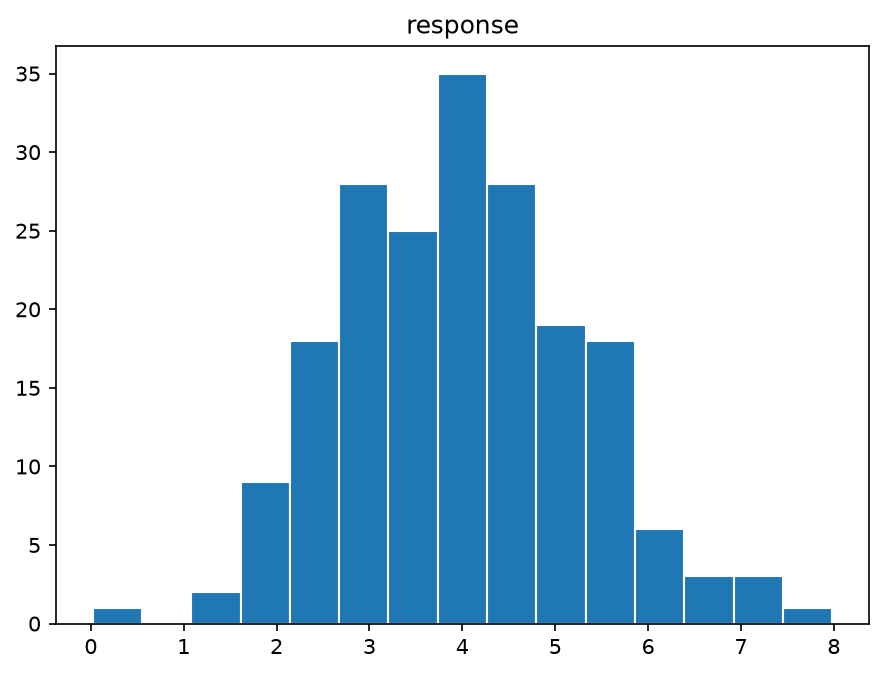
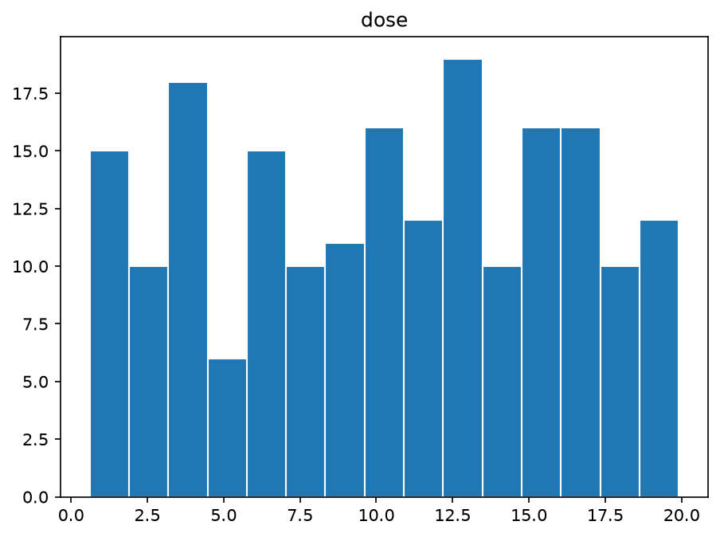
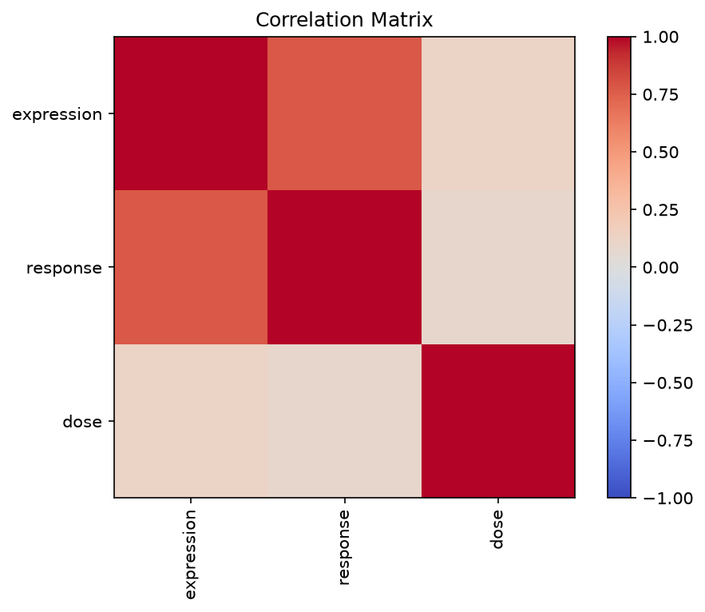
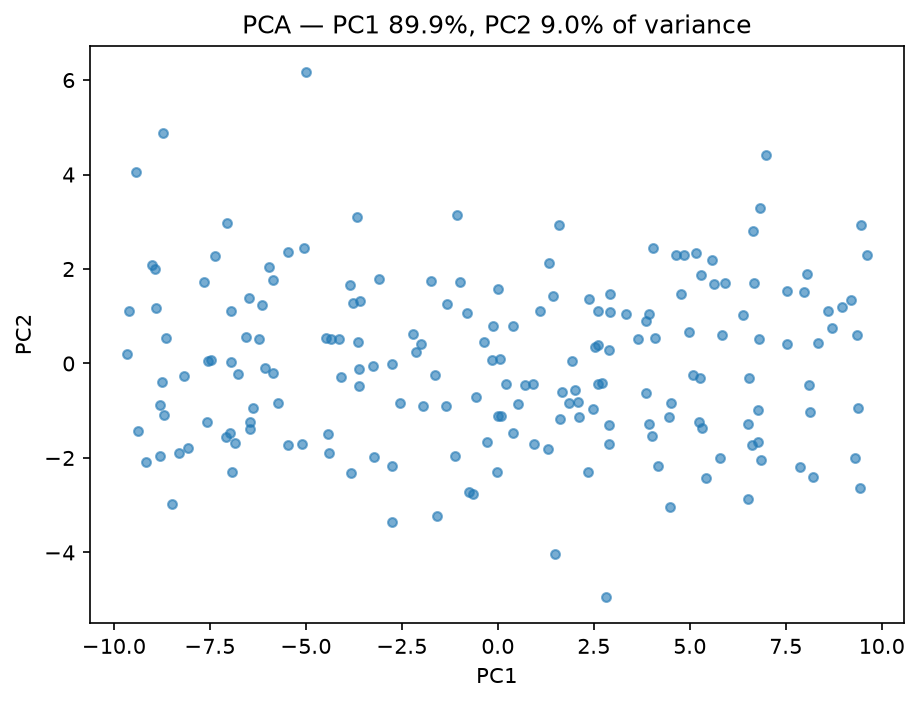

# BioData Report

200 rows x 5 columns

## Missing values

| column | dtype | missing | missing_pct |
| --- | --- | --- | --- |
| sample_id | str | 0 | 0.0 |
| expression | float64 | 4 | 2.0 |
| response | float64 | 4 | 2.0 |
| dose | float64 | 4 | 2.0 |
| group | str | 0 | 0.0 |

## Descriptive statistics

| statistic | count | mean | std | min | 25% | 50% | 75% | max |
| --- | --- | --- | --- | --- | --- | --- | --- | --- |
| expression | 196.0 | 4.95473469387755 | 1.3316670990097463 | 1.802 | 4.01525 | 4.922 | 5.80225 | 9.371 |
| response | 196.0 | 3.978030612244898 | 1.2971131611791773 | 0.019 | 3.03925 | 3.9825 | 4.836 | 7.984 |
| dose | 196.0 | 10.352142857142857 | 5.61022038965608 | 0.61 | 5.6475 | 10.575 | 14.9925 | 19.91 |

## Correlation matrix

| expression | response | dose |
| --- | --- | --- |
| 1.0 | 0.777952249923856 | 0.11779586974265542 |
| 0.777952249923856 | 1.0 | 0.08867048092109223 |
| 0.11779586974265542 | 0.08867048092109223 | 1.0 |

## Figures

---
*Generated by BioData (BioResearchOS). Research/educational use only.*
